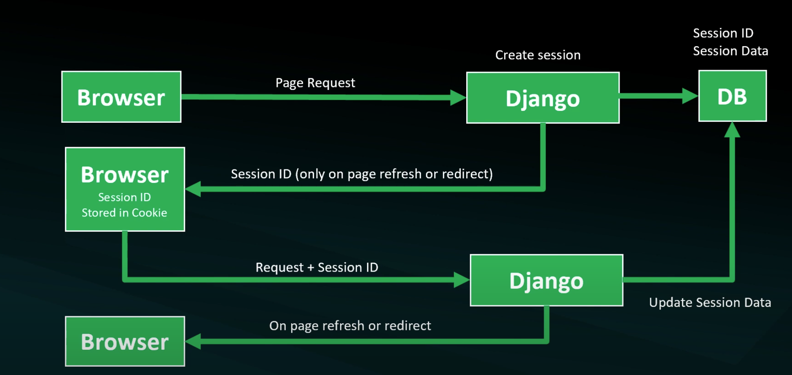

# Candidate Number: 260032

## Project Notes

---

### Aims & Objectives

The proposed project is an ecommerce web application for students to shop for learning resources 

#### Sessions
- Session is temporary and interactive information
- Single user per session - save retrieve arbitrary data on a per-site-visitor basis
- Store the data on the server side 
- User recieves a session ID
- Session ID is used to retrieve the associated data

#### Sessions Set up
- Setup 
- Create session
- context processor (site-wide access)
- Add to session functionality