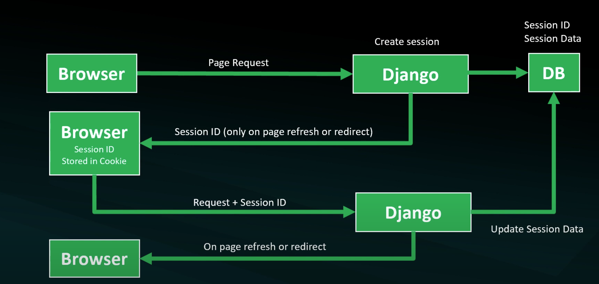

# Candidate Number: 260032\

## Cover sheet:

## UNI LOGO

## Degree Course and Department

## Title of the Project

## Name of Supervisor

## Year of Submission

---

## Signed Statement of Originality

---

## Acknowledgment/Dedication Page

---

### Project Notes

## Abstract

- **Novel Nook** is an online platform that provides a comprehensive digital library for students, offering access to a vast collection of academic textbooks and learning resources.
- It aims to revolutionize the way students access and engage with educational materials by providing an affordable, convenient, and environmentally friendly alternative to traditional print textbooks.
- The site's core focus is on making education more accessible and affordable for students worldwide.
- **Novel Nook** offers a subscription-based model that grants students unlimited access to a wide range of textbooks and learning materials at a fraction of the cost of purchasing physical copies. This approach enables students to save money, reduce the burden of carrying heavy textbooks, and access resources conveniently from any device with internet connectivity.
- The resources emphasize user experience and functionality, providing students with intuitive features such as highlighting, note-taking, and search capabilities within the digital texts. These features enhance the learning experience, allowing students to personalize their study materials and easily find relevant information.
- **Novel Nook** aims to disrupt the traditional textbook market by offering a modern, cost-effective, and eco-friendly solution for students. With its extensive library, user-friendly interface, and commitment to accessibility and sustainability, Perlego serves as a valuable resource for students seeking an efficient and affordable way to access educational materials.

---

## Table of Figures

## Table of Contents

## Introduction

### Motivation

The project covers a range of topics including:

- Django URLS, models, views
- Django templates
- Unit Tests
- Testing with PyTest
- Working with Django and Docker
- Deploying Django Applications

E-Commerce's rapid expansion has revolutionised the way organisations function, opening up new opportunities for growth, efficiency, and customer involvement. As technology evolves, it is critical for organisations to embrace creative solutions in order to remain competitive in the digital market. In this context, the purpose of this dissertation is to investigate the construction of an eCommerce application utilising the Django framework, with a particular emphasis on using its extensive features and functionalities to establish a scalable and efficient online store.
The fundamental motivation for this research is to address existing gaps and issues that eCommerce businesses encounter, such as sophisticated inventory management, secure payment processing, personalised user experiences, and smooth order fulfilment.

### Aims & Objectives

The objectives of this research encompass two key aspects. Firstly, we intend to design and develop a comprehensive eCommerce application utilizing Django, tailored specifically for an online bookstore catering to programming students. This application will encompass essential features such as an extensive product catalog, personalized user profiles, secure payment integration, shopping cart management, and streamlined order processing. By focusing on the unique needs and preferences of programming students, we aim to create an intuitive and engaging platform that fosters an optimal learning experience.

Secondly, we plan to evaluate the performance and scalability of our developed application. Through rigorous testing, we will assess its ability to efficiently handle concurrent user requests, effectively manage a vast inventory of programming books, and ensure the integrity and security of sensitive customer data. By conducting in-depth performance analysis and benchmarking, we will gather valuable insights to optimize the application's performance, identify potential bottlenecks, and recommend best practices for similar eCommerce platforms targeting programming students.

By achieving these objectives, this research endeavors to contribute to the existing body of knowledge by providing valuable insights into leveraging Django for developing specialized eCommerce platforms. The findings and recommendations derived from this study will serve as a valuable resource for online bookstores targeting programming students, empowering them to create immersive learning environments and meet the unique requirements of their target audience.

### Structure of the Report

..add something...

---

## BODY

### Background

### Methodology

### Data Analysis

### Findings and Discussion

### Limitations/Issues

- Session ID is only generated only when user is in the basket page.
- When the basket subtotal was added to the basket page, it did not show. Resolved by adding the quantity to the delete basket from the summary template, `document.getElementById("basket-qty").innerHTML = json.qty`
- When item was deleted from the basket, the number counter in the basket icon showed `undefined` instead of updating the value.

``` python
Error: ecommerce/basket/views.py", line 30, in basket_delete
    product_id = int(request.POST.get('productid'))
TypeError: int() argument must be a string, a bytes-like object or a number, not 'NoneType'
```

- Editing account details does not work, shows 200 status code but does not change username, deleting account does.
- The default option does not include the shipping total.

#### Sessions

- Session is temporary and interactive information
- Single user per session - save retrieve arbitrary data on a per-site-visitor basis
- Store the data on the server side
- User recieves a session ID
- Session ID is used to retrieve the associated data



#### Sessions Set up

- Setup
- Create session
- context processor (site-wide access)
- Add to session functionality

### Part 2

#### Sessions development - Delete Session data

- View all items in the basket
- Add a delete button
- Create AJAX request to delete item
- Add new function in Basket class
- JS - remove item from basket

#### Sessions development - Updating the data

- send an update request from Ajax
- Handling the update request (qty)
- Change the front-end data (price and qty)
- Develop the front-end code to update the basket
- Debug issues
- Testing

### Part 3 - Ecommerce store user, payment and other management

#### Stages

- Refactoring - style/UI updates
- User Management - Signup, Login, Logout, Dashboard, Password Reset
- Payment - Template, Payment, Capture Payment
- Order Management
- Testing

#### Orders

- Saving Orders
- Confirm payments
- Finish the payment templates
- Add orders to user's dashboard

### Part 5 - Multi-Product Types Database Integration

- Black + isort
- Requirements.txt
- Django-debug-toolbar
- Manage settings.py
- Databse Schema
- Building the Database - MPTT, Internalization
- Store table template integration

#### Login Details

```python
email: a@a.com
username: john
password: johnjohn1
```
